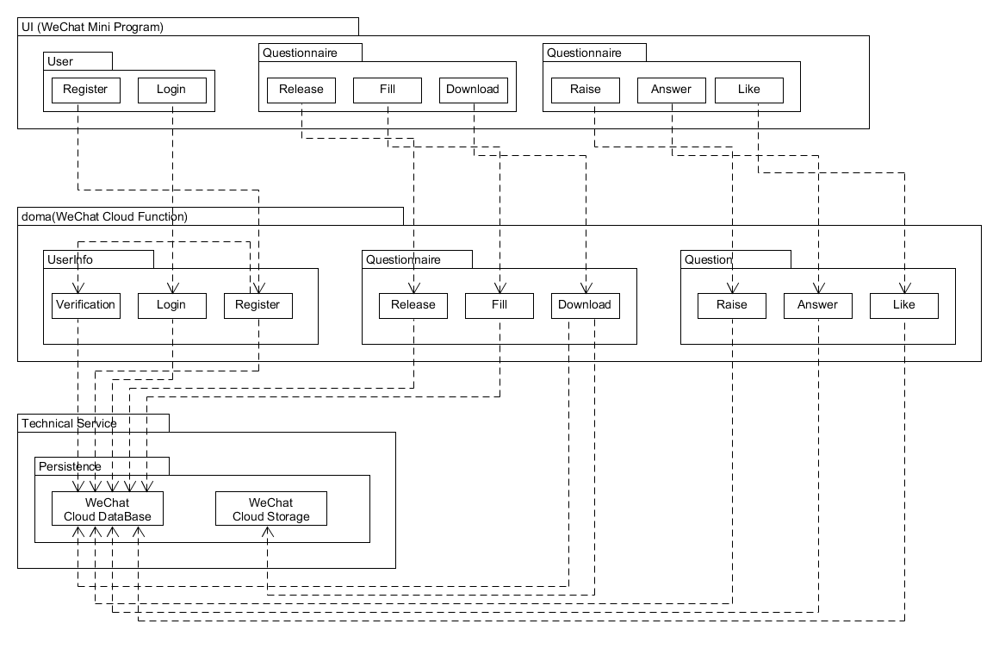

# 架构设计

## 架构逻辑

逻辑架构由四层模型（表示层、业务层、服务层、持久化层）构成 

1. 表示层

用户使用的微信小程序APP作为表示层，提供UI界面，供用户调用服务层提供的各种服务如发问卷，发问题，回答问卷，回答问题等等。

2. 业务层

微信云平台充当业务层的角色，将用户的输入传递到各个服务层的模块中。

3. 服务层

云开发的云函数充当了服务层，根据表示层传来的数据访问对象，创建模型，更新、返回持久化层的数据，执行特定的应用逻辑和操作。

4. 持久化层

云开发的数据库和存储模块充当持久化层，持久化存储用户信息，问卷，问答的相关数据。

## 架构逻辑图



## 框架目录设计

```
├─cloudfunctions
│  ├─add_info
│  ├─answer_question
│  ├─ask_question
│  ├─clean_verification
│  ├─fill_in_questionnaire
│  ├─get_all_questionnaire
│  ├─get_answer
│  ├─get_question
│  ├─get_questionnaire_detail
│  ├─get_reply
│  ├─get_user_question
│  ├─get_user_questionnaire
│  ├─login
│  ├─recv_verification
│  ├─release_questionnaire
│  ├─reply_question
│  ├─send_verification
│  ├─update_info
│  └─update_like
├─miniprogram
   ├─images
   ├─pages
   │  ├─addFunction
   │  ├─chooseLib
   │  ├─databaseGuide
   │  ├─deployFunctions
   │  ├─index
   │  ├─storageConsole
   │  ├─testCloudFunction
   │  ├─userConsole
   │  └─yaoxh6
   │      ├─aboutUs
   │      ├─answerQA
   │      ├─customerService
   │      ├─item
   │      ├─login
   │      ├─mine
   │      ├─myAnswer
   │      ├─myInfo
   │      ├─myQuestion
   │      ├─myWallet
   │      ├─posted
   │      ├─publish
   │      ├─publish2
   │      ├─QA
   │      ├─questionnaire
   │      ├─task
   │      └─test
   └─style
```