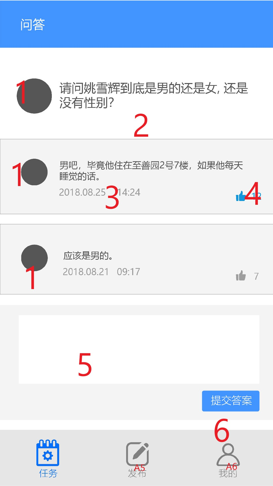
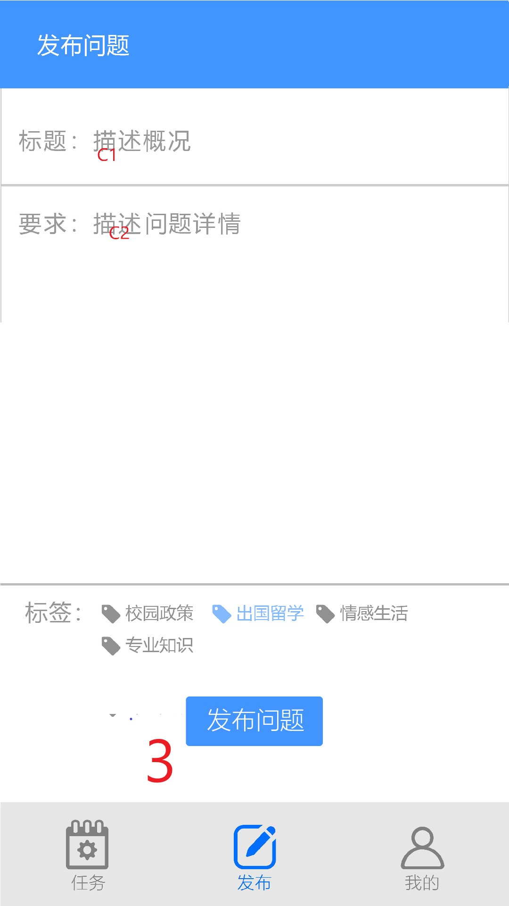
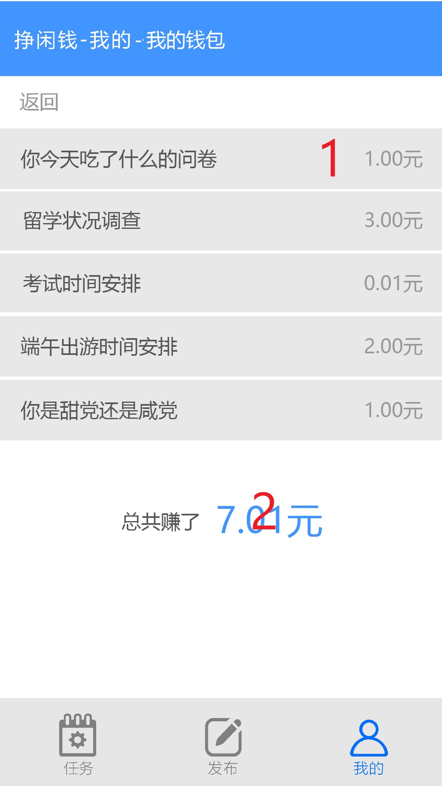

# UI设计说明
溢出部分如无说明默认使用scroll

## X任务列表与任务详情界面
### X1：问卷与问答的罗列界面

- A1：点击条目进入B任务详情界面。条目中标题的第十个字（如果存在）会自动替换成…，十个字之后的内容不显示
- A2：点击区域会出现drop down，中有五个栏目：东校、南校、珠海、深圳、北校。默认是东校。点击drop down栏目中的任意一个则根据对应的选项刷新界面。
- A3：点击类型后会出现drop down，中有四个栏目：全部、问卷、被试、兼职。默认是全部。点击drop down栏目中的任意一个则根据对应的选项刷新界面。
- A4：点击排序（灰度比A2A3要高，且是粗体）后会出现drop down，中有四个栏目：时间顺序、时间逆序、佣金顺序、佣金逆序。默认是时间逆序
- A5：点击发布进入Y发布界面。但是不应该刷新（从发布界面点回任务界面，任务界面和发布界面内的内容应该不变）
- A6：点击进入我的任务Z界面。
- A7：字符串匹配，点击可以搜索含有对应字符串的任务（搜索字段包括位置、标题、金额）
- A8：点击可以重新根据当前A2A3A4的值生成任务列表。
### X2：问答的回答与浏览界面

- 1：头像，用一个固定的图案代替。（技术限制无法获得回答用户的微信头像）
- 2：问题的内容和描述
- 3：该用户的回答。
- 4 ：点击可以给该回答带来赞。高赞回答会被系统放在更靠前的地方。已经点过的赞图标会变成灰色，再次点击则会取消点赞。
- 5 ：回答栏。在里面可以输入回答。在任何时候如果重新点开问题，如果之前回答过这个问题，则此处自动变成之前回答的内容，用户修改并更新答案。
- 6：提交答案：如果点击，则提交问答，并刷新界面。
### X3：问卷的填写界面

- B1：返回。返回A任务列表界面。当前界面将不会保存
- B2：选项。点击后该框被勾选
- B3：点击后跳转到发布界面
- B4：点击后跳转到我的任务界面
- B5：点击后空心点变为实心点
- B6（图标待做，预计和C7一模一样）：确定提交。

## Y任务详情界面
### Y1发布的两个选择界面

- 1：点击进入y3发布问卷的编辑界面
- 2：点击进入Y2发布问答的编辑界面
### Y2发布问答的编辑界面

- 1：填写问题的标题即问题（案例：如何安装visualstudio2017？）
- 2：描述问题的具体信息（案例：我电脑内存只有2g，一打开安装包就会卡崩）
- 3：点击可以发布问题，跳转至X任务浏览界面。
### Y3发布问卷的编辑界面

- C1：点击可以输入文字，最多不能超过20个汉字。（直接用库了）
- C2：点击可以输入文字。（用库）文本溢出部分使用Scroll的交互方法。
- C3：点击自动弹出数字键盘，可以输入数字，这是佣金总数。最多不超过10000。
- C4：点击可选择分类类型：问卷、被试、兼职
- C5：点击可以选择校区：东校、南校、北校、珠海、深圳
- C6：弹出系统时间选择。这是任务的截止期限
- C7：向服务器提交任务表单
- 1：点击可以在问卷中添加一个问题或者删除当前问题
- 2：可以增加或删除一个选项
（这一部分程序逻辑部分比较复杂，涉及到页面跳转和编辑功能，所以只提供逻辑上的样例示范，对具体设计不做要求）

## Z我的任务界面

### Z1 我的信息界面

这个界面可以对已经发布的问卷和问答进行管理，还可以查看到开发团队和运营团队的联系方式，以及修改个人信息
- 1：我的头像，通过微信API自动获取
- 2：我的回答，点击可以出现我的所有回答，类似于Z4（不赘述了）
- 3：问题管理，可以管理我的所有发布的问题，类似于Z6
- 4：问卷管理，点击跳转至Z6
- 5：我的钱包，点击跳转至Z4
- 6：关于我们，点击跳转至Z3
- 7：客服中心，点击跳转至Z5
- 8：个人设置，点击跳转至Z2
### Z2 我的个人设置界面

- 1：用户的姓名信息
- 2：用户的学号
- 3：用户的邮箱信息
- 4：点击可以保存更改，但不需要跳转
- 5：点击可以返回界面Z1
### Z3 制作者声明界面

开发团队的学号和姓名，方便老师批阅

### Z4 我的钱包界面

- 1： 显示之前填过的问卷名称，并显示赚到的钱
- 2： 对所有的结果累加得到赚到的总钱数
### Z5 客服中心界面

客服的联系方式。
### Z6已完成问卷的下载界面

- 1：点击可以导出该数据为excel

标题栏蓝色：#66 148 255  #42 94 FF
底边栏蓝色：#143 240 120  #8F F0 78
备注、时间、底边栏灰色：#160 0 180 #A0 0 B4