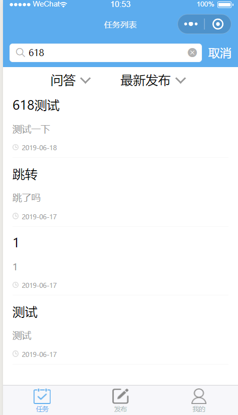

# 等价类划分
##X1 任务列表界面

- X1A1：搜索栏为空 
- X1A2: 搜索栏有字且点击搜索
- X1B1: 点击选择问答
- X1B2：点击选择问卷
- X1C1：点击选择最新发布
- X1C2：点击选择最多报酬
- X1D1：点击问答项目
- X1E1：点击问卷项目
##X2 问答浏览与回答界面

- X2A1：给未点过赞的回答点赞
- X2A2：给点过赞的回答消赞
- X2B1：发布只有空格的评论
- X2B2：发布有非空格的字符串的评论
- X2B3：发布空的评论
##X3 问卷浏览与提交界面

- X3A1：发布者填写自己的问卷
- X3B1：单选题在未选中的情况下选中选项
- X3B2：单选题在已经有选中的情况下选中别的选项
- X3C1：多选题选中选项
- X3C2：多选题多选
- X3D1：问答题空
- X3D2：问答题有字符串
##Y1 发布问卷和发布问答的入口界面

- Y1A1：点击发布问答
- Y1A2: 点击发布问卷

##Y2 发布问答的界面

- Y2A1：输入标题为空字符串
- Y2A2：输入标题为空格字符串
- Y2A3：输入标题为非空格字符串
- Y2B1：输入描述为空字符串
- Y2B2：输入描述为空格字符串
- Y2B3：输入描述为非空格字符串
- YE:点击发布

##Y3 发布问卷的界面

- Y3A1：输入标题为空字符串
- Y3A2：输入标题为空格字符串
- Y3A3：输入标题为非空格字符串
- Y3B1：输入描述为空字符串
- Y3B2：输入描述为空格字符串
- Y3B3：输入描述为非空格字符串
- Y3C1：问卷报酬为0
- Y3C2：问卷报酬非0
- Y3D1：问卷投递份数为0
- Y3D2：问卷投递分数非0
- Y3E1：？？
- Y3F1：截止时间是当前时间之前
- Y3F2：截止时间是当前时间之后
- Y3G1：多选题问题为空字符串
- Y3G2：多选题问题为空格字符串
- Y3G3：多选题问题为非空格字符串
- Y3G4：多选题选项为空字符串
- Y3G5：多选题选项为空格字符串
- Y3G6：多选题选项为非空格字符串
- Y3G7：多选题新增一个选项
- Y3G8：多选题减少一个选项
- Y3G9：删除当前多选题
- Y3H1：单选题问题为空字符串
- Y3H2：单选题问题为空格字符串
- Y3H3：单选题问题为非空格字符串
- Y3H4：单选题选项为空字符串
- Y3H5：单选题选项为空格字符串
- Y3H6：单选题选项为非空格字符串
- Y3H7：单选题新增一个选项
- Y3H8：单选题减少一个选项
- Y3H9：删除当前单选题
- Y3I1：问答题问题为空字符串
- Y3I2：问答题问题为空格字符串
- Y3I3：问答题问题为非空格字符串
- Y3J1：无任何题目
- Y3J2：有题目
- YE：点击发布

##Z1 我的界面

- Z1A1：点击我的回答
- Z1A2：点击问题管理
- Z1A3：点击问卷管理
- Z1B1：点击我的钱包
- Z1B2：点击关于我们
- Z1B3：点击客服中心
- Z1B4：点击个人信息

##Z2 我的回答管理界面

- Z2A1: 点击问题详情或整个栏目

##Z3 我的问题管理界面

- Z3A1：点击问题详情或整个栏目

##Z4 我发布的问卷管理页面
- Z4A1：点击点击下载

### 用例设计

