# 众包系统竞品分析报告

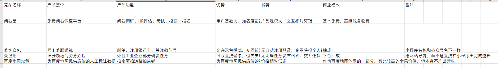
## 背景

 众包模式是常见的劳务雇佣模式。总的来说受雇人员良莠不齐，而且雇佣地点分散。 基于微信小程序的众包小程序数量惊人，开发成本低，“护城河”不高。实际上，很多众包小程序都是专门服务于某一特定产品或者应用的。

另外一方面，问卷星几乎垄断了所有问卷发放平台，并且延申向企业咨询服务。

-----

## 竞品分析

本文选取了四个有代表性的app来分析众包类app的市场。

### 问卷星
这是老牌问卷领域的老牌APP，涵盖业务非常广，而且覆盖面广

- 产品定位：免费问卷调查平台

- 产品功能：问卷调研、HR评估、考试、投票、报名

- 优势：用户基数大，知名度最高，功能齐全

- 劣势：产品规模大，交互相对繁琐

- 商业模式：基本免费，高级服务收费

### 兼客众包

- 产品定位：网上兼职赚钱

- 产品功能：刷单、注册银行卡、关注微信号

- 优势：允许承包模式，交互简洁

- 劣势：无自动注册登录；企图获得个人敏感信息；内容劣质，以银行卡注册、刷好评等为主；体量很小

- 商业模式：抽成

- 备注：小程序名称和公众号名不一样

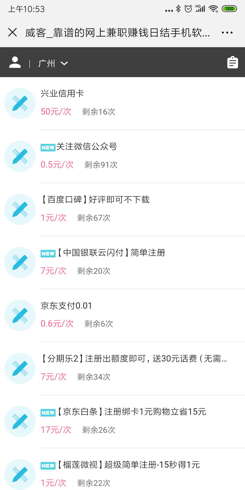
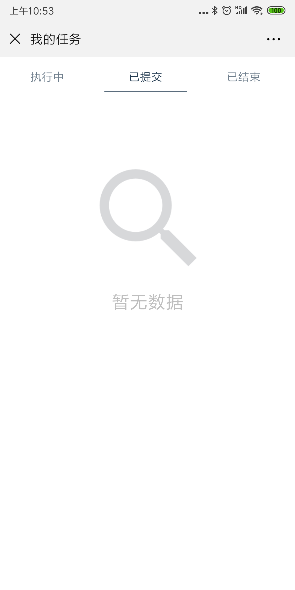
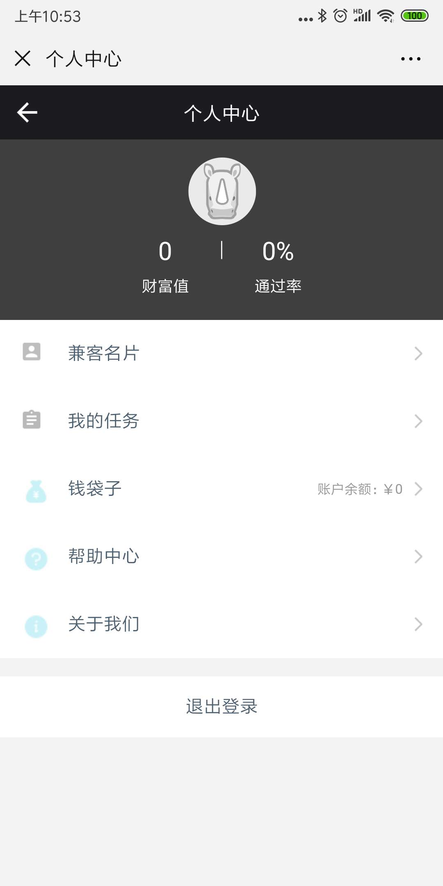
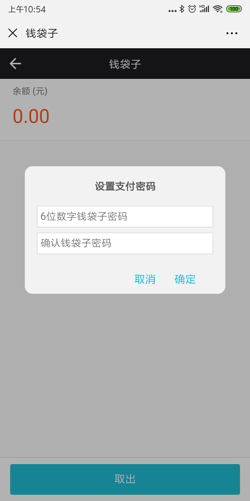
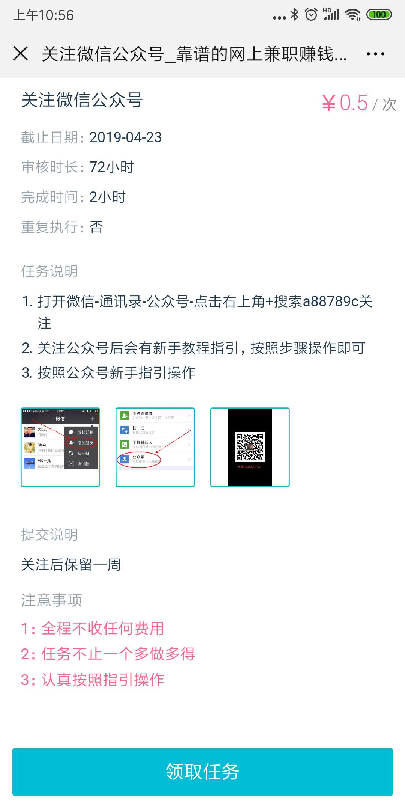
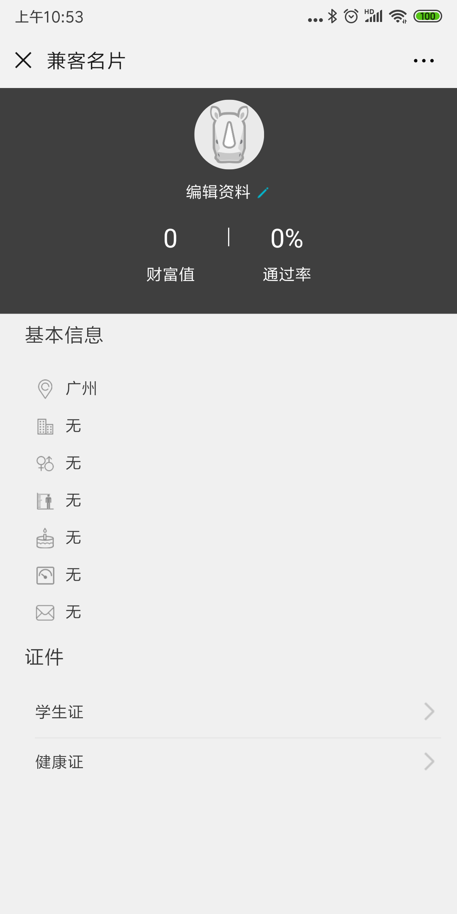
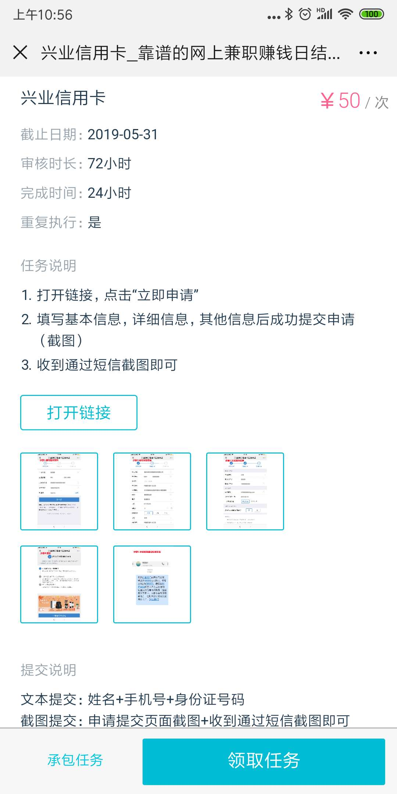

### 众包吧
- 产品定位：细分领域的劳务众包

- 产品功能：外包工业企业部分研发任务

- 优势：可以直接登录，但需要验证手机；行业细分，切实解决用户需求；通过证书、学历对接单者能力进行考核；

- 劣势：无明确任务发布格式；交互逻辑不明晰

- 商业模式：平台抽成

- 备注：给网站导流，而不是直接在小程序里完成流程

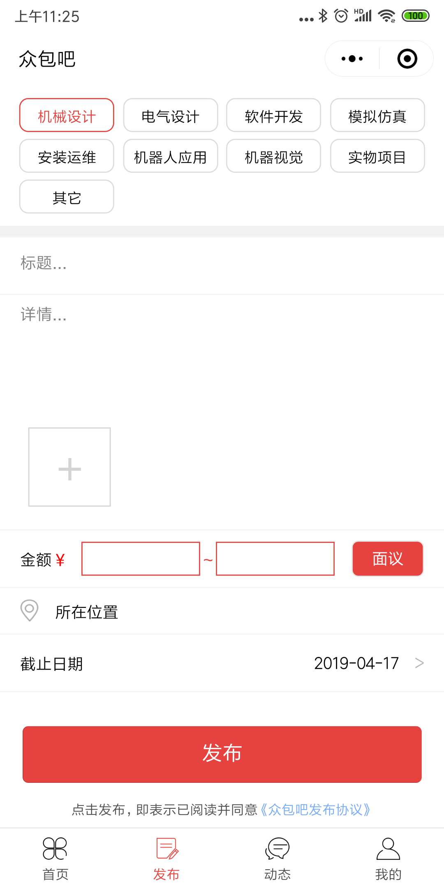
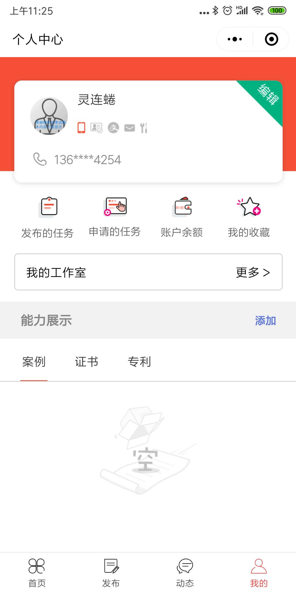
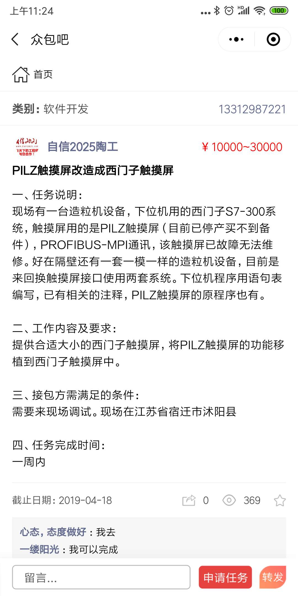
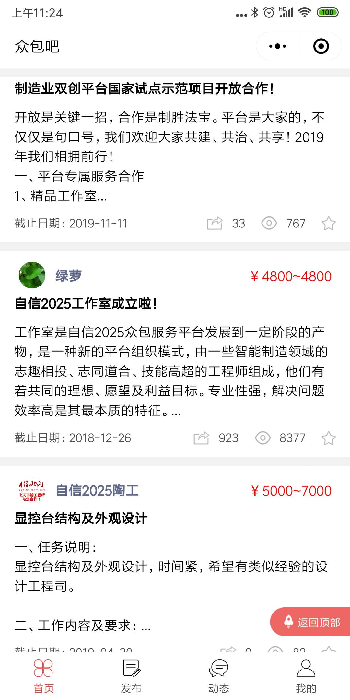
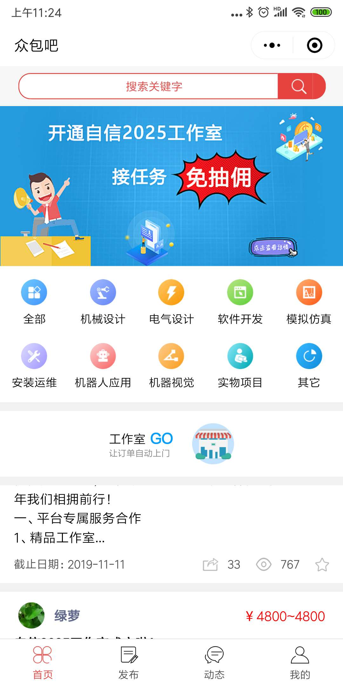

### 百度地图众包
这个是所有竞品中我觉得最有意思的。

- 产品定位：百度地图的廉价数据供应商

- 产品功能：收集实时街道数据、打折数据，提交给百度赚取零钱

- 优势：特用性强，对于百度有很强的使用价值。

- 劣势：用户赚到的外快金额一般 本身没有产出价值

- 商业模式：百度地图提供资金，雇佣用户为它做一些数据收集的工作。

- 备注：为百度提供人工矫正的街景地图，可以实时更新地图情报(哪个店铺换了店面、哪里打折、商场内部怎么走)，solution driven（解决方案驱动），也可以减少百度地图的运营成本。

- 百度地图众包是典型的大手公司的众包玩法。实际上类似的产品还有贴吧、知乎的内容编辑众包、猿题库的做题赚钱（收集难度信息）、网易腾讯的游戏测试众包。这类众包往往应用于收集用户数据，优化产品体验。

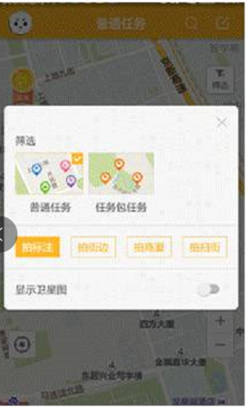
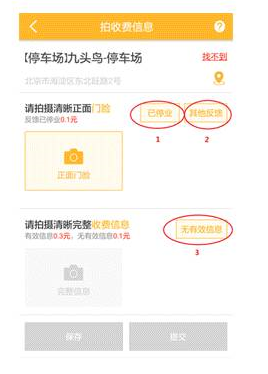
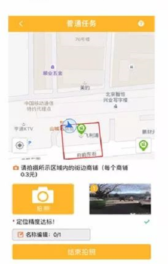
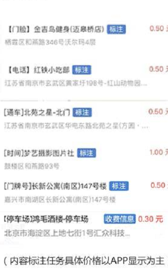

-----
