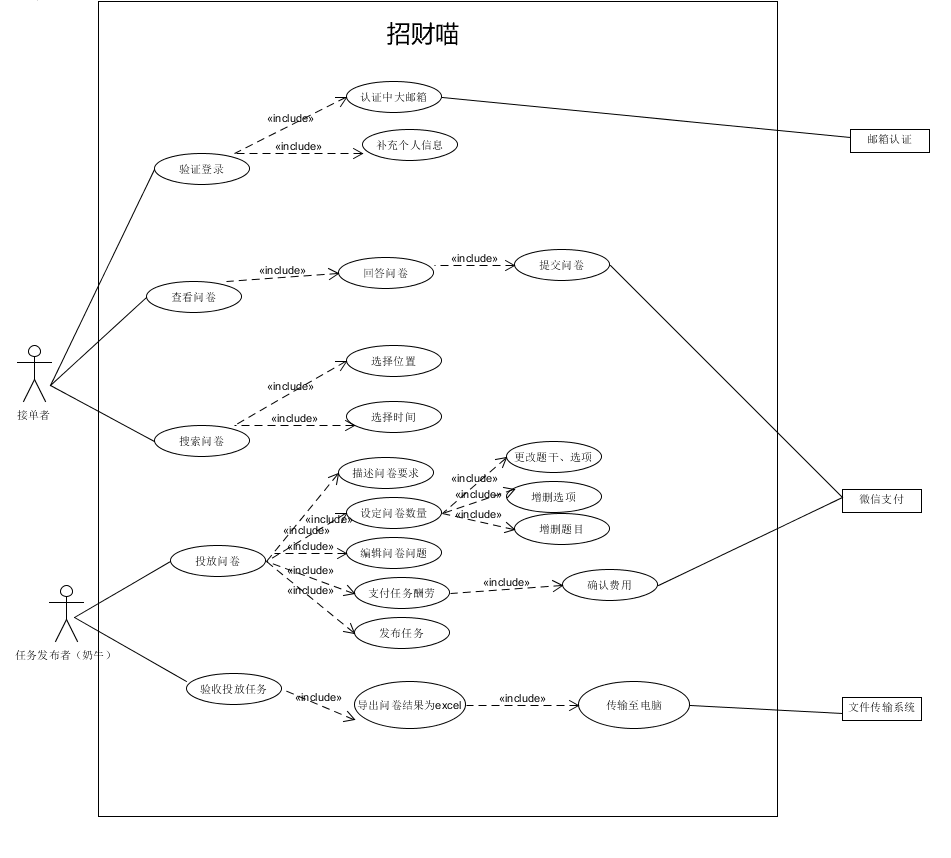

## 用例图

### 问卷模块

用接单者和问卷发布者（奶牛）区分发布问卷的用户和填写问卷的用户，列出两者的用例如下，其中接单者有7个用例，问卷发布者（奶牛）有6个用例。

#### 接单者

- 验证登录：第一次进入系统的时候需要进行中大邮箱认证，包括认证邮箱和补充个人信息。
- 认证中大邮箱：用户需要输入正确的中大邮箱，系统将发送验证邮件到填写的邮箱，用户登录邮箱后接收验证码即可验证。
- 补充个人信息：填写姓名、学号、学院、专业信息。
- 查看问卷：包含填写问卷，玩家点击心仪的问卷即可跳转到填写问卷页面。
- 回答问卷：对问卷进行填写，包括了提交问卷。
- 提交问卷：点击提交问卷。
- 搜索问卷：用来选择适合自己的问卷，包括关键字匹配。

#### 问卷发布者（奶牛）

- 投放问卷：包括描述问卷需求、设定问卷数量、编辑问卷问题、支付任务酬劳。
- 描述问卷要求：描述这个问卷的大概内容。
- 设定问卷数量：设定待发布的问卷的总数目。
- 编辑问卷问题：编辑要发布的问卷的内容，有单选题、多选题、问答题，可以在编辑界面更改选项、增删选项、增删题目。
- 支付问卷酬劳：进行核算，公式为问卷报酬*问卷数量。
- 验收投放任务：包括导出问卷结果为excel。

### 问题模块

用提问者和回答者区分发布问题的用户和填写问卷的用户，列出两者的用例如下，其中提问者有1个用例，回答者有2个用例。

#### 提问者

- 投放问题：包括编辑问题标题和编辑问题描述。

#### 回答者

- 查看问题：包括回答问题和点赞。
- 搜索问题：包括关键字匹配。

