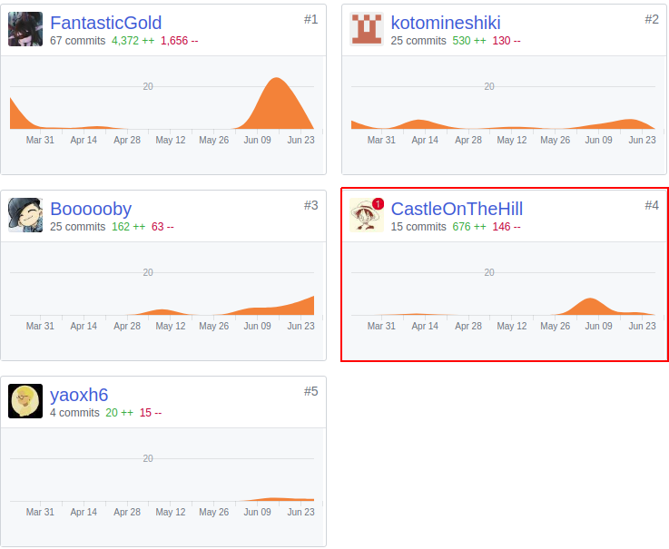
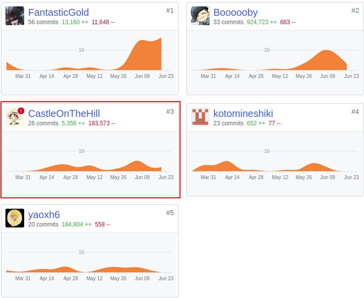

# 16340076 CastleOnTheHill Final Report

## 个人简短小结

- 作为后端工程师，在项目中我完成的内容如下：
  - 制定后端[代码规范]([https://swsad.github.io/Dashboard/8-%E7%94%9F%E4%BA%A7%E8%A7%84%E8%8C%83%E4%B8%8E%E6%8C%87%E5%8D%97/1.1-%E6%8B%9B%E8%B4%A2%E5%96%B5%E4%BB%A3%E7%A0%81%E8%A7%84%E8%8C%83](https://swsad.github.io/Dashboard/8-生产规范与指南/1.1-招财喵代码规范))
  - 部分后端API的设计实现
  - [架构设计](https://swsad.github.io/Dashboard/7-design/4.1-architecture-design)
- 除了后端的任务外，我还做到了以下几项：
  - 坚持每周开例会、写看板，保证项目的进展，可以参考[看板](https://github.com/swsad/Dashboard/projects)
  - 参与了一些前端页面的逻辑实现

## PSP 2.1 统计

|                                       | **Personal Software Process Stages**   | **Time (%)** |
| ------------------------------------- | -------------------------------------- | ------------ |
| **Planning**                          | **计划**                               | **5**        |
| estimate                              | 预估任务时间                           | 5            |
| **Development**                       | **开发**                               | **85**       |
| analysis                              | 需求分析                               | 10           |
| design spec                           | 生成设计文档                           | 2            |
| estimate                              | 设计复审                               | 2            |
| coding standard                       | 代码规范                               | 1            |
| design                                | 具体设计                               | 15           |
| coding                                | 具体编码                               | 30           |
| code review                           | 代码复审                               | 10           |
| test                                  | 测试                                   | 15           |
| **Report**                            | **报告**                               | **10**       |
| test report                           | 测试报告                               | 5            |
| size measurement                      | 计算工作量                             | 1            |
| postmortem & process improvement plan | 每次迭代结束后进行总结，并提出改进计划 | 4            |

## 主要工作清单

- 有价值：坚持了14周的持续开发，体验了一个软件产品的计划、需求分析、设计、实现、测试、发布整个开发流程
- 有苦劳：参与部分前端代码的实际、实现、测试

## 在项目相关仓库中的贡献

- Dashboard 文档仓库

  

- Code 代码仓库

  

## 个人博客清单

### 特别感谢

- FantasticGold，始终对项目保持巨大的激情，每周都认真地参与会议，积极讨论项目的设计，完成会议的记录。特别是在最后时期，组员或是实习，或是忙于其他的项目，master仍然坚守在项目上，站好了最后一班岗！
- Boooooby，后端战友，许多后端的难题都是在和bobby的讨论之下才有了解决方案，对代码和界面的精益求精的精神也感染了平时懒散的我，让我能坚持把项目做完。
- Yasoxh6，因为使用了小程序云开发技术，前端的工作量其实是比后端大得多的，而且一些页面，如问卷的动态生成和解析页面的实现也是十分复杂，xh顶住了压力，攻克了难题，让项目有了易用的问卷发放功能。
- kotomineshiki，为我们的项目设计了许多精美的界面，合理功能和使用流程，严格控制了项目的需求，让项目始终处于一个可控的状态之下。
